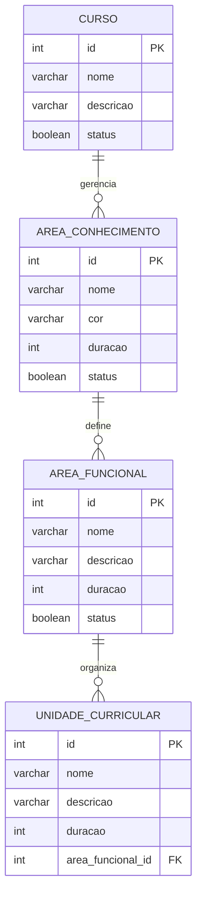

# Diagrama de Entidade e Relacionamento(DER)

```mermaid
erDiagram
    CURSO {
        int id PK
        varchar nome
        varchar descricao
        boolean status
    }

    AREA_CONHECIMENTO {
        int id PK
        varchar nome
        varchar cor
        int duracao
        boolean status
    }

    AREA_FUNCIONAL {
        int id PK
        varchar nome
        varchar descricao
        int duracao
        boolean status
    }

    UNIDADE_CURRICULAR {
        int id PK
        varchar nome
        varchar descricao
        int duracao
        int area_funcional_id FK
    }

    CURSO ||--o{ AREA_CONHECIMENTO : gerencia
    AREA_CONHECIMENTO ||--o{ AREA_FUNCIONAL : define
    AREA_FUNCIONAL ||--o{ UNIDADE_CURRICULAR : organiza

```