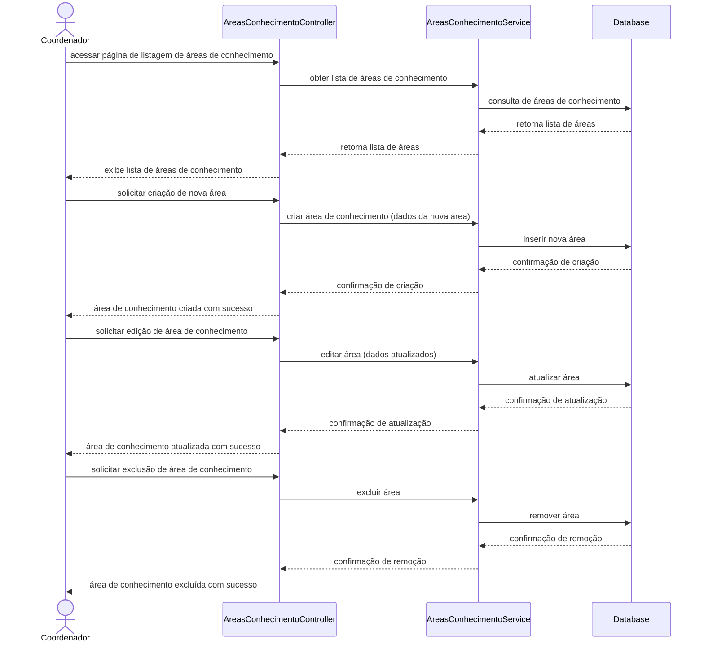

```mermaid
    sequenceDiagram
    actor Coordenador
    Coordenador ->> AreasConhecimentoController: acessar página de listagem de áreas de conhecimento
    AreasConhecimentoController ->> AreasConhecimentoService: obter lista de áreas de conhecimento
    AreasConhecimentoService ->> Database: consulta de áreas de conhecimento
    Database -->> AreasConhecimentoService: retorna lista de áreas
    AreasConhecimentoService -->> AreasConhecimentoController: retorna lista de áreas
    AreasConhecimentoController -->> Coordenador: exibe lista de áreas de conhecimento

    Coordenador ->> AreasConhecimentoController: solicitar criação de nova área
    AreasConhecimentoController ->> AreasConhecimentoService: criar área de conhecimento (dados da nova área)
    AreasConhecimentoService ->> Database: inserir nova área
    Database -->> AreasConhecimentoService: confirmação de criação
    AreasConhecimentoService -->> AreasConhecimentoController: confirmação de criação
    AreasConhecimentoController -->> Coordenador: área de conhecimento criada com sucesso

    Coordenador ->> AreasConhecimentoController: solicitar edição de área de conhecimento
    AreasConhecimentoController ->> AreasConhecimentoService: editar área (dados atualizados)
    AreasConhecimentoService ->> Database: atualizar área
    Database -->> AreasConhecimentoService: confirmação de atualização
    AreasConhecimentoService -->> AreasConhecimentoController: confirmação de atualização
    AreasConhecimentoController -->> Coordenador: área de conhecimento atualizada com sucesso

    Coordenador ->> AreasConhecimentoController: solicitar exclusão de área de conhecimento
    AreasConhecimentoController ->> AreasConhecimentoService: excluir área
    AreasConhecimentoService ->> Database: remover área
    Database -->> AreasConhecimentoService: confirmação de remoção
    AreasConhecimentoService -->> AreasConhecimentoController: confirmação de remoção
    AreasConhecimentoController -->> Coordenador: área de conhecimento excluída com sucesso

```