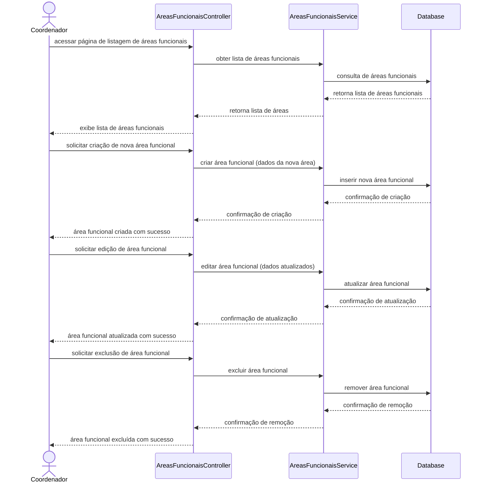

```mermaid
    sequenceDiagram
    actor Coordenador
    Coordenador ->> AreasFuncionaisController: acessar página de listagem de áreas funcionais
    AreasFuncionaisController ->> AreasFuncionaisService: obter lista de áreas funcionais
    AreasFuncionaisService ->> Database: consulta de áreas funcionais
    Database -->> AreasFuncionaisService: retorna lista de áreas funcionais
    AreasFuncionaisService -->> AreasFuncionaisController: retorna lista de áreas
    AreasFuncionaisController -->> Coordenador: exibe lista de áreas funcionais

    Coordenador ->> AreasFuncionaisController: solicitar criação de nova área funcional
    AreasFuncionaisController ->> AreasFuncionaisService: criar área funcional (dados da nova área)
    AreasFuncionaisService ->> Database: inserir nova área funcional
    Database -->> AreasFuncionaisService: confirmação de criação
    AreasFuncionaisService -->> AreasFuncionaisController: confirmação de criação
    AreasFuncionaisController -->> Coordenador: área funcional criada com sucesso

    Coordenador ->> AreasFuncionaisController: solicitar edição de área funcional
    AreasFuncionaisController ->> AreasFuncionaisService: editar área funcional (dados atualizados)
    AreasFuncionaisService ->> Database: atualizar área funcional
    Database -->> AreasFuncionaisService: confirmação de atualização
    AreasFuncionaisService -->> AreasFuncionaisController: confirmação de atualização
    AreasFuncionaisController -->> Coordenador: área funcional atualizada com sucesso

    Coordenador ->> AreasFuncionaisController: solicitar exclusão de área funcional
    AreasFuncionaisController ->> AreasFuncionaisService: excluir área funcional
    AreasFuncionaisService ->> Database: remover área funcional
    Database -->> AreasFuncionaisService: confirmação de remoção
    AreasFuncionaisService -->> AreasFuncionaisController: confirmação de remoção
    AreasFuncionaisController -->> Coordenador: área funcional excluída com sucesso 
```