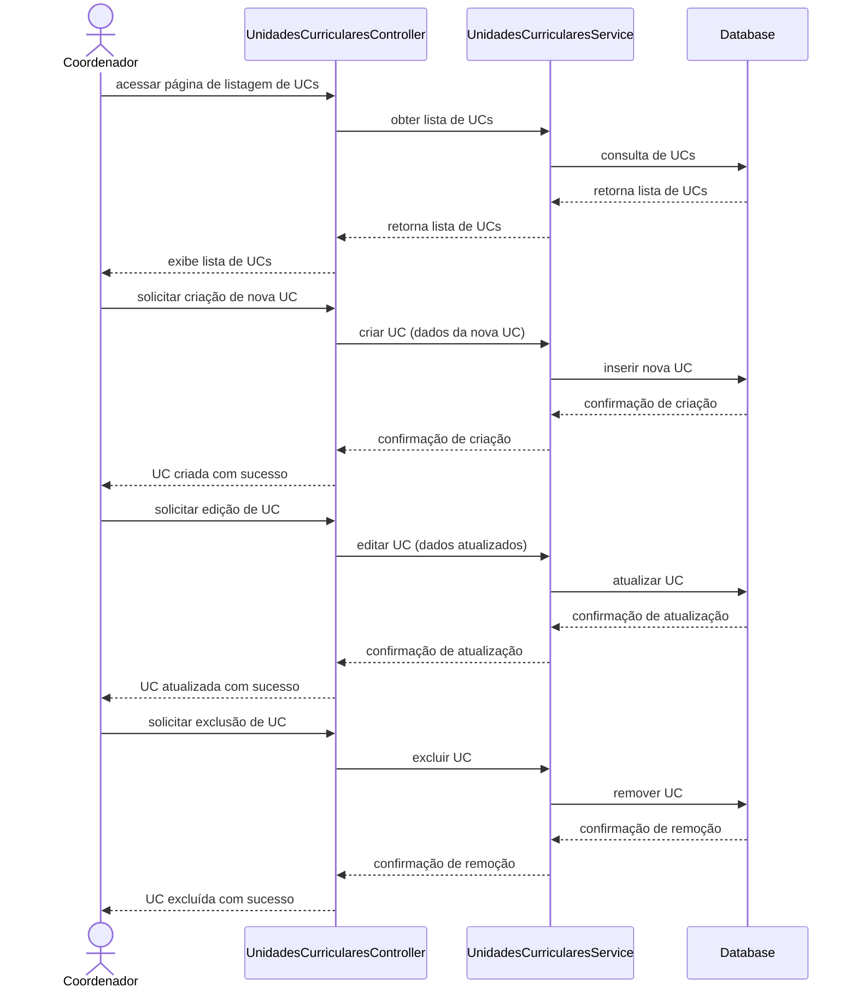

```mermaid
    sequenceDiagram
    actor Coordenador
    Coordenador ->> UnidadesCurricularesController: acessar página de listagem de UCs
    UnidadesCurricularesController ->> UnidadesCurricularesService: obter lista de UCs
    UnidadesCurricularesService ->> Database: consulta de UCs
    Database -->> UnidadesCurricularesService: retorna lista de UCs
    UnidadesCurricularesService -->> UnidadesCurricularesController: retorna lista de UCs
    UnidadesCurricularesController -->> Coordenador: exibe lista de UCs

    Coordenador ->> UnidadesCurricularesController: solicitar criação de nova UC
    UnidadesCurricularesController ->> UnidadesCurricularesService: criar UC (dados da nova UC)
    UnidadesCurricularesService ->> Database: inserir nova UC
    Database -->> UnidadesCurricularesService: confirmação de criação
    UnidadesCurricularesService -->> UnidadesCurricularesController: confirmação de criação
    UnidadesCurricularesController -->> Coordenador: UC criada com sucesso

    Coordenador ->> UnidadesCurricularesController: solicitar edição de UC
    UnidadesCurricularesController ->> UnidadesCurricularesService: editar UC (dados atualizados)
    UnidadesCurricularesService ->> Database: atualizar UC
    Database -->> UnidadesCurricularesService: confirmação de atualização
    UnidadesCurricularesService -->> UnidadesCurricularesController: confirmação de atualização
    UnidadesCurricularesController -->> Coordenador: UC atualizada com sucesso

    Coordenador ->> UnidadesCurricularesController: solicitar exclusão de UC
    UnidadesCurricularesController ->> UnidadesCurricularesService: excluir UC
    UnidadesCurricularesService ->> Database: remover UC
    Database -->> UnidadesCurricularesService: confirmação de remoção
    UnidadesCurricularesService -->> UnidadesCurricularesController: confirmação de remoção
    UnidadesCurricularesController -->> Coordenador: UC excluída com sucesso


```