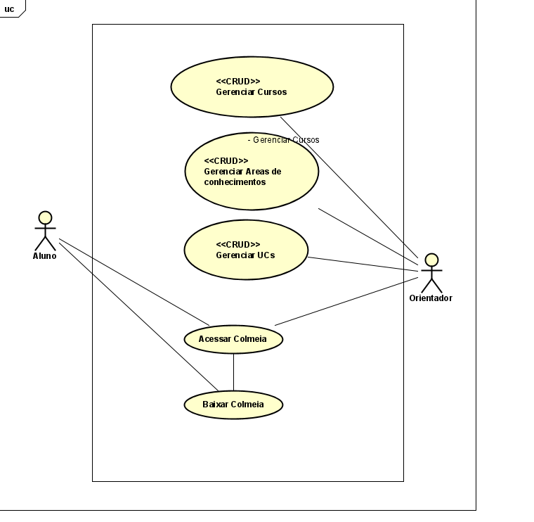
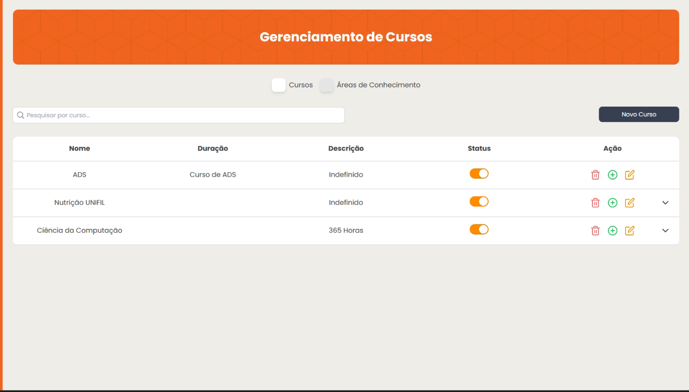
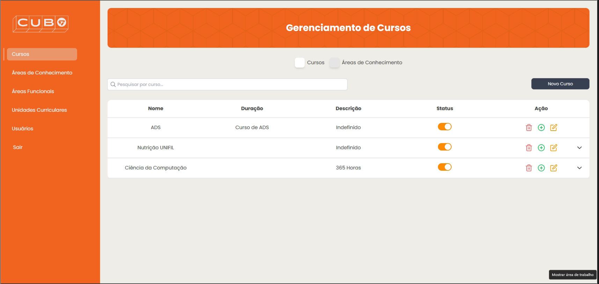
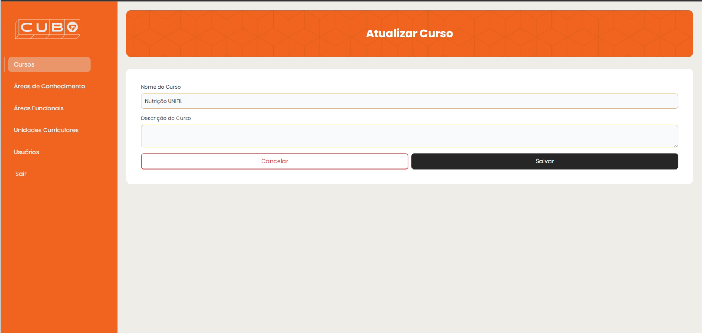
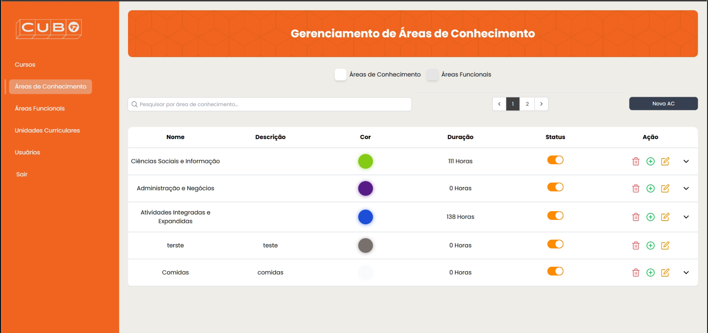
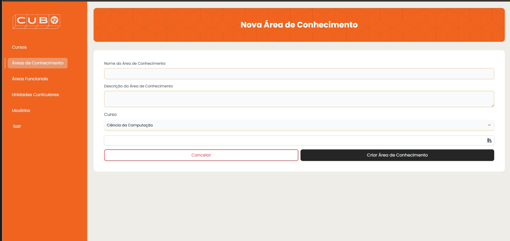
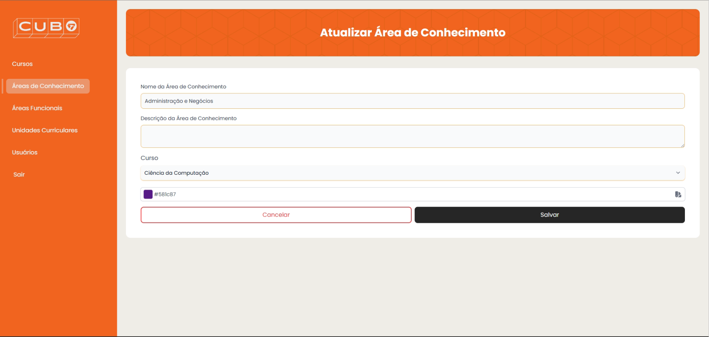
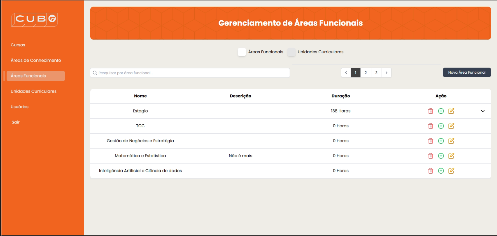
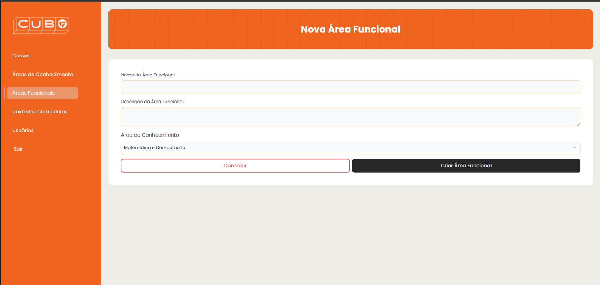
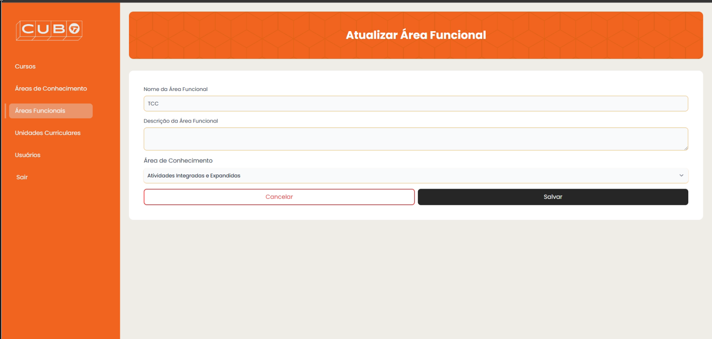

CURSO DE BACHARELADO EM CIENCIA DA COMPUTAÇÃO\
João Vitor Deliberador \
Mario Henrique Akihiko da Costa Adaniya\
PROJETO COLMEIA CUBO\
Londrina\
2024
===

## SUMÁRIO

- [AGRADECIMENTOS](#agradecimentos)
- [INTRODUÇÃO](#introdução)
- [DESCRIÇÃO DO SISTEMA](#descrição-do-sistema)
  - [FRONT-END](#front-end)
  - [BACK-END](#back-end)
  - [BANCO DE DADOS](#banco-de-dados)
  - [DIAGRAMAÇÃO](#diagramação)
- [MODELAGEM DO SISTEMA](#modelagem-do-sistema)
  - [DIAGRAMA DE CASO DE USO](#diagrama-de-caso-de-uso)
  - [DIAGRAMA DE CLASSE](#diagrama-de-classe)
  - [DIAGRAMA DE ENTIDADE E RELACIONAMENTO (DER)](#diagrama-de-entidade-e-relacionamento-der)
  - [CASOS DE USO](#casos-de-uso)
    - [UC001 - GERENCIAR CURSOS](#uc001---gerenciar-cursos)
    - [UC002 - GERENCIAR ÁREAS DE CONHECIMENTO](#uc002---gerenciar-áreas-de-conhecimento)
    - [UC003 - GERENCIAR ÁREAS FUNCIONAIS](#uc003---gerenciar-áreas-funcionais)
    - [UC004 - GERENCIAR UNIDADES CURRICULARES](#uc004---gerenciar-unidades-curriculares)
- [CONCLUSÕES E TRABALHOS FUTUROS](#conclusões-e-trabalhos-futuros)
- [REFERÊNCIAS](#referências)
- [APÊNDICE](#apêndice)
  - [ARTEFATOS DE REQUISITOS](#artefatos-de-requisitos)
    - [Documento de Visão](#documento-de-visão)
    - [Especificação Suplementar](#especificação-suplementar)
    - [Especificações de Caso de Uso](#especificações-de-caso-de-uso)
    - [Glossário](#glossário)
    - [Pedido do Investidor](#pedido-do-investidor)
  - [DIAGRAMAS](#diagramas)
    - [Diagrama de Caso de Uso](#diagrama-de-caso-de-uso-1)
    - [Diagrama de Classes](#diagrama-de-classes)
    - [Diagrama de Entidade e Relacionamento (DER)](#diagrama-de-entidade-e-relacionamento-der-1)
    - [Diagramas de Estado](#diagramas-de-estado)
    - [Diagrama de Implantação](#diagrama-de-implantação)
    - [Diagramas de Sequência](#diagramas-de-sequência)
  - [Workflow AS-IS](#workflow-as-is)
  - [Workflow TO-BE](#workflow-to-be)

## AGRADECIMENTOS

Gostaria de expressar minha gratidão a todos que contribuíram direta ou indiretamente para a realização deste projeto. 

Agradeço ao meu professor orientador Mario pelo suporte e principalmente pela paciencia na orientação em todas as fases do projeto. Sempre me ajudando á entender cada vez mais do projeto e me ajudando a ser melhor tanto como pessoa mas como proficional 

Aos colegas que compartilharam conhecimentos e experiências, que enriqueceram meu aprendizado e me incentivaram a seguir em frente.

Agradeço à UniFil por oferecer um ambiente de prática e desenvolvimento, proporcionando a oportunidade de desenvolver um projeto real e aplicável à instituição.

Por fim, Á Deus e á minha familia e amigos proximos que em momentos dificis do projeto sempre estiveram comigo  

## INTRODUÇÃO

O projeto Colmeia CUBO foi desenvolvido no âmbito do Núcleo de Práticas em Informática (NPI) do Centro Universitário Filadélfia (UniFil), com o objetivo de transformar a gestão curricular da instituição através de uma solução digital inovadora e centralizada. O NPI, atuando como uma Empresa Júnior, se dedica a proporcionar aos alunos experiências práticas que consolidem os conhecimentos teóricos adquiridos em sala de aula, ao mesmo tempo em que atendem a demandas institucionais reais.

A proposta do Colmeia CUBO surge como uma resposta à complexidade e aos desafios associados à administração manual das estruturas curriculares, que anteriormente eram organizadas utilizando ferramentas convencionais como planilhas e apresentações. Esse método não apenas consumia um tempo significativo de coordenadores e orientadores, mas também dificultava a atualização e o acesso rápido às informações pelos alunos.

Através do Colmeia CUBO, é possível gerenciar, de forma eficiente e dinâmica, os cursos oferecidos pela UniFil, as áreas de conhecimento, áreas funcionais e unidades curriculares. Além disso, a interface intuitiva do sistema permite que alunos visualizem sua estrutura curricular organizada em formato de colmeia, promovendo uma experiência visual clara e interativa.

O projeto também reflete um esforço para automatizar processos, minimizar erros e criar um ambiente acadêmico mais conectado e funcional. Ele integra tecnologias modernas e práticas de desenvolvimento, garantindo que o sistema seja robusto, acessível e adaptado às necessidades dos diferentes usuários, como alunos, professores e coordenadores.

O Colmeia CUBO não apenas moderniza a gestão curricular, mas também contribui para a autonomia dos alunos e a eficiência do trabalho dos coordenadores. Este relatório detalha as etapas de desenvolvimento, as tecnologias empregadas e os desafios superados para a implementação deste projeto, que se tornou um marco na transformação digital da UniFil.

## DESCRIÇÃO DO SISTEMA

O sistema **Colmeia CUBO** centraliza informações curriculares, proporcionando uma visão clara e organizada da estrutura de cursos. Funciona 24/7 e oferece funcionalidades como:

- **Gerenciamento de Cursos**: Adicionar, atualizar e remover cursos.
- **Gerenciamento de Áreas de Conhecimento**: Definir e personalizar áreas de conhecimento.
- **Gerenciamento de Áreas Funcionais**: Adicionar, atualizar e remover áreas funcionais.
- **Gerenciamento de Unidades Curriculares (UCs)**: Organizar UCs por carga horária e conteúdo.
- **Visualização da Colmeia Curricular**: Interface de consulta para alunos e professores.

### *FRONT-END*

Tecnologias utilizadas no *front-end*:

- ***[HTML5](https://developer.mozilla.org/pt-BR/docs/Web/HTML)***: Estrutura de conteúdo.
- ***[CSS3](https://developer.mozilla.org/pt-BR/docs/Web/CSS)*** (utilizando ***[Tailwind CSS](https://tailwindcss.com/)***): Estilização e responsividade.
- ***[JavaScript](https://developer.mozilla.org/pt-BR/docs/Web/JavaScript)*** (utilizando ***[Alpine.js](https://alpinejs.dev/)***): Adição de interatividade leve.
- ***[Livewire](https://laravel-livewire.com/)***: Componentização de interfaces no Laravel.

### *BACK-END*

Tecnologias no *back-end*:

- ***[Laravel 11](https://laravel.com/)***: Framework PHP para lógica de negócios e gerenciamento de dados.
- ***[Laravel Sanctum](https://laravel.com/docs/11.x/sanctum)***: Autenticação de usuários para Single Page Applications (SPA).
- ***[Livewire](https://laravel-livewire.com/)***: Para componentização, facilitando a criação de interfaces reativas sem necessidade de uma API separada.

### BANCO DE DADOS

- ***[MySQL](https://www.mysql.com/)***: Sistema de gerenciamento de banco de dados.

### DIAGRAMAÇÃO

Para a criação dos diagramas, foram utilizadas as ferramentas:

- ***[draw.io](https://app.diagrams.net/)***
- ***[Mermaid](https://mermaid.js.org/)***

## MODELAGEM DO SISTEMA

### DIAGRAMA DE CASO DE USO

O diagrama de caso de uso detalha os requisitos funcionais do sistema, abordando as interações entre usuários e funcionalidades do sistema **Colmeia CUBO**.

A Figura 1 refere-se ao diagrama de caso de uso do sistema.

Figura 1

### DIAGRAMA DE CLASSE

O diagrama de classes é uma ferramenta essencial na modelagem orientada a objetos, proporcionando uma visão detalhada e estruturada do sistema que é crucial para o desenvolvimento de software eficiente e bem-organizado.

[Diagrama de Classes](https://github.com/UniFil-NPI/Colmeia-Cubo/blob/main/docs/diagramadeclasse.md)

### DIAGRAMA DE ENTIDADE E RELACIONAMENTO (DER)

O diagrama DER é uma ferramenta crucial na modelagem de dados, permitindo que você visualize e organize as informações de forma estruturada e lógica, o que é essencial para o design e implementação eficaz de sistemas de banco de dados.

[Diagrama de Entidade e Relacionamento](https://github.com/UniFil-NPI/Colmeia-Cubo/blob/main/docs/DER.md)

### CASOS DE USO

#### UC001_GERENCIAR_CURSOS

Este caso de uso permite que o Coordenador gerencie os cursos.

##### Telas

- **Tela de Listagem de Cursos**

  

- **Tela de Criação de Novo Curso**

  

- **Tela de Edição de Curso Existente**

  

#### UC002_GERENCIAR_AREAS_DE_CONHECIMENTO

Permite que o Coordenador gerencie as áreas de conhecimento, incluindo a personalização de cor.

##### Telas

- **Tela de Listagem de Áreas de Conhecimento**

  

- **Tela de Criação de Nova Área de Conhecimento**

  

- **Tela de Edição de Área de Conhecimento**

  

#### UC003_GERENCIAR_AREAS_FUNCIONAIS

O Coordenador pode gerenciar as áreas funcionais, definindo e organizando as UCs.

##### Telas

- **Tela de Listagem de Áreas Funcionais**

  

- **Tela de Criação de Nova Área Funcional**

  

- **Tela de Edição de Área Funcional**

  

### **CONCLUSÕES E TRABALHOS FUTUROS**

O projeto **Colmeia CUBO** foi uma iniciativa essencial para modernizar e digitalizar a gestão curricular da UniFil, centralizando informações e automatizando processos que anteriormente eram complexos e manuais. Os resultados alcançados foram satisfatórios, atendendo aos requisitos iniciais e proporcionando uma interface intuitiva e eficiente para coordenadores, professores e alunos. A estrutura modular do sistema e o uso de tecnologias modernas garantem sua escalabilidade e flexibilidade.

Durante o desenvolvimento, houve um aprofundamento significativo em tecnologias como **[Laravel](https://laravel.com/)**, **[Livewire](https://laravel-livewire.com/)** e **[Alpine.js](https://alpinejs.dev/)**, que se mostraram ferramentas indispensáveis para a construção de interfaces dinâmicas e reativas. A utilização do **[MySQL](https://www.mysql.com/)** para o gerenciamento de banco de dados consolidou a base sólida de armazenamento e recuperação de informações.

Embora o sistema atenda às demandas atuais, existem possibilidades promissoras para evoluções futuras, como:

- **Notificações Inteligentes**: Automatização de alertas para coordenadores e alunos sobre atualizações curriculares, prazos de atividades e mudanças no sistema.
- **Integração com Sistemas Acadêmicos Externos**: Conectar o Colmeia CUBO a plataformas como bibliotecas digitais, sistemas de notas e calendários acadêmicos, ampliando sua utilidade.
- **Relatórios Avançados**: Adicionar módulos para gerar relatórios detalhados sobre desempenho acadêmico, frequência de acessos e outras métricas úteis para tomadas de decisão.
- **Personalização Avançada**: Possibilitar que coordenadores adaptem o sistema às necessidades específicas de seus cursos e alunos.

Concluímos que o **Colmeia CUBO** será uma ferramenta indispensável para a gestão curricular da UniFil, promovendo eficiência, acessibilidade e organização. O sistema, como um ponto de partida, representa apenas o início de um ecossistema digital acadêmico mais robusto e integrado, com potencial para expandir suas funcionalidades e benefícios para outros contextos educacionais.

## REFERÊNCIAS

1. Colmeia CUBO. Disponível em: [https://unifil.br/cubo/](https://unifil.br/cubo/)
2. Yggdrasil2. Disponível em: [https://akafts.github.io/yggdrasil2/](https://akafts.github.io/yggdrasil2/)
3. Honeycomb - Hexagons. Disponível em: [https://abbekeultjes.nl/honeycomb/](https://abbekeultjes.nl/honeycomb/)
4. Documentação do Laravel. Disponível em: [https://laravel.com/docs/11.x](https://laravel.com/docs/11.x)
5. Documentação do Livewire. Disponível em: [https://laravel-livewire.com/](https://laravel-livewire.com/)
6. Documentação do Tailwind CSS. Disponível em: [https://tailwindcss.com/](https://tailwindcss.com/)

## APÊNDICE

### ARTEFATOS DE REQUISITOS

####  [Documento de visão](visao.md)

#### [Especificaçao Suplementar](especificacao_suplementar.md)

#### Especificações de Caso de Uso: 

- ##### [UC001 GERENCIAR CURSOS](<Especificaçoes de Caso De Uso/UC001_gerenciar_cursos.md>)
- ##### [UC002 GERENCIAR AREAS DE CONHECIMENTO](<Especificaçoes de Caso De Uso/UC002_gerenciar_AC.md>)
- ##### [UC003 GERENCIAR AREAS FUNCIONAIS](<Especificaçoes de Caso De Uso/UC003_Gerenciar_AF.md>)
- ##### [UC003 GERENCIAR AREAS DE CONHECIMENTO](<Especificaçoes de Caso De Uso/UC003_gerenciar_UC.md>)

#### [Glossário](glossario.md)

#### [Pedido do Investidor](PedidodeInvestidor.md)

### DIAGRAMAS

 [Diagrama de Caso de Uso](caso_de_uso.md)

 [Diagrama de Classes](diagramadeclasse.md)

 [Diagrama de Entidade e Relacionamento](DER.md)

## Diagramas de Estado:

- [UC001_GERENCIAR_CURSOS](<Diagrama de Sequencia/UC001_GERENCIAR_CURSOS.md>)

- [UC002_GERENCIAR_AREAS_DE_CONHECIMENTO](<Diagrama de Sequencia/UC002_GERENCIAR_AREAS_DE_CONHECIMENTO.md>)

- [\[UC003_GERENCIAR_AREAS_FUNCIONAIS\]](<Diagrama de Sequencia/UC003_GERENCIAR_AREAS_FUNCIONAIS.md>)

- [\[UC004_GERENCIAR_UNIDADES_CURRICULARES\]](<Diagrama de Sequencia/UC004_GERENCIAR_UNIDADES_CURRICULARES.md>)

### [Diagrama de Implantação](diagrama_de_implementacao.md)

#### Diagramas de Sequência:

- [UC001_GERENCIAR_CURSOS](<Diagrama de Sequencia/UC001_GERENCIAR_CURSOS.md>)

- [UC002_GERENCIAR_AREAS_DE_CONHECIMENTO](<Diagrama de Sequencia/UC002_GERENCIAR_AREAS_DE_CONHECIMENTO.md>)

- [UC003_GERENCIAR_AREAS_FUNCIONAIS](<Diagrama de Sequencia/UC003_GERENCIAR_AREAS_FUNCIONAIS.md>)

- [UC004_GERENCIAR_UNIDADES_CURRICULARES](<Diagrama de Sequencia/UC004_GERENCIAR_UNIDADES_CURRICULARES.md>)

## [Workflow AS-IS](workflow_asis.md)

## [Workflow TO-BE](workflow_to_be.md)

---

[Voltar](README.md)
