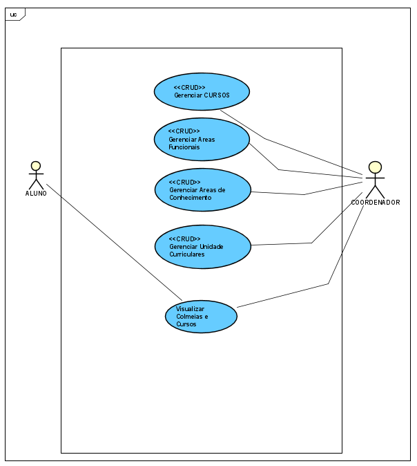
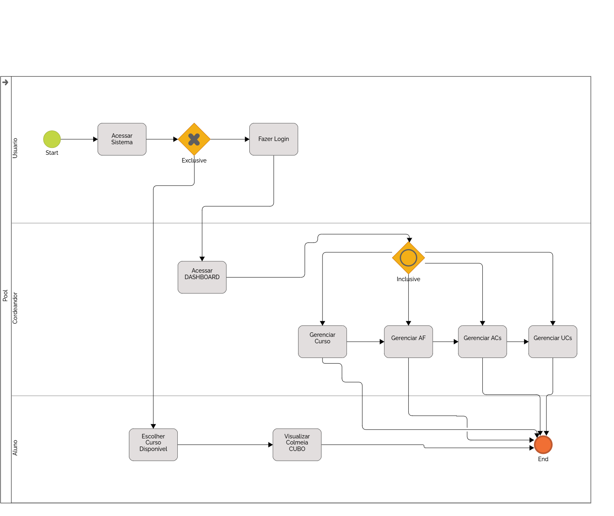

CURSO DE BACHARELADO EM CIENCIA DA COMPUTAÇÃO\
João Vitor Deliberador \
Mario Henrique Akihiko da Costa Adaniya\
PROJETO COLMEIA CUBO\
Londrina\
2024
===

## SUMÁRIO

- [2024](#2024)
  - [SUMÁRIO](#sumário)
  - [AGRADECIMENTOS](#agradecimentos)
  - [INTRODUÇÃO](#introdução)
  - [DESCRIÇÃO DO SISTEMA](#descrição-do-sistema)
    - [*FRONT-END*](#front-end)
    - [*BACK-END*](#back-end)
    - [BANCO DE DADOS](#banco-de-dados)
    - [DIAGRAMAÇÃO](#diagramação)
  - [MODELAGEM DO SISTEMA](#modelagem-do-sistema)
    - [DIAGRAMA DE CASO DE USO](#diagrama-de-caso-de-uso)
    - [DIAGRAMA DE CLASSE](#diagrama-de-classe)
    - [DIAGRAMA DE ENTIDADE E RELACIONAMENTO](#diagrama-de-entidade-e-relacionamento)
    - [CASOS DE USO](#casos-de-uso)
      - [UC001\_GERENCIAR\_CURSOS](#uc001_gerenciar_cursos)
        - [Telas](#telas)
      - [UC002\_GERENCIAR\_AREAS\_DE\_CONHECIMENTO](#uc002_gerenciar_areas_de_conhecimento)
        - [Telas](#telas-1)
      - [UC003\_GERENCIAR\_AREAS\_FUNCIONAIS](#uc003_gerenciar_areas_funcionais)
        - [Telas](#telas-2)
  - [CONCLUSÕES E TRABALHOS FUTUROS](#conclusões-e-trabalhos-futuros)
  - [REFERÊNCIAS](#referências)
  - [APÊNDICE](#apêndice)
    - [ARTEFATOS DE REQUISITOS](#artefatos-de-requisitos)
      - [Documento de visão](#documento-de-visão)
      - [Especificaçao Suplementar](#especificaçao-suplementar)
      - [Especificações de Caso de Uso:](#especificações-de-caso-de-uso)
      - [Glossário](#glossário)
      - [Pedido do Investidor](#pedido-do-investidor)
    - [DIAGRAMAS](#diagramas)
  - [Diagrama de Caso de Uso](#diagrama-de-caso-de-uso-1)
  - [Diagrama de Classes](#diagrama-de-classes)
  - [Diagrama de Entidade e Relacionamento](#diagrama-de-entidade-e-relacionamento-1)
  - [Diagramas de Estado:](#diagramas-de-estado)
  - [Diagrama de Implantação](#diagrama-de-implantação)
      - [Diagramas de Sequência:](#diagramas-de-sequência)
  - [Workflow AS-IS](#workflow-as-is)

## AGRADECIMENTOS

Gostaria de expressar minha gratidão a todos que contribuíram direta ou indiretamente para a realização deste projeto. 

Agradeço ao meu professor orientador Mario pelo suporte e principalmente pela paciencia na orientação em todas as fases do projeto. Sempre me ajudando á entender cada vez mais do projeto e me ajudando a ser melhor tanto como pessoa mas como proficional 

Aos colegas que compartilharam conhecimentos e experiências, que enriqueceram meu aprendizado e me incentivaram a seguir em frente.

Agradeço à UniFil por oferecer um ambiente de prática e desenvolvimento, proporcionando a oportunidade de desenvolver um projeto real e aplicável à instituição.

Por fim, Á Deus e á minha familia e amigos proximos que em momentos dificis do projeto sempre estiveram comigo  

## INTRODUÇÃO

O projeto **Colmeia CUBO** foi desenvolvido pelo Núcleo de Práticas em Informática (NPI) do Centro Universitário Filadélfia (UniFil), com o objetivo de digitalizar e centralizar a gestão curricular da instituição. 

O NPI, como uma Empresa Júnior, visa consolidar conhecimentos acadêmicos através de projetos práticos. Este projeto surgiu para facilitar o gerenciamento de cursos, áreas de conhecimento e unidades curriculares, oferecendo uma interface intuitiva e acessível para alunos, orientadores e coordenadores.

## DESCRIÇÃO DO SISTEMA

O sistema **Colmeia CUBO** centraliza informações curriculares, proporcionando uma visão clara e organizada da estrutura de cursos. Funciona 24/7 e oferece funcionalidades como:

- **Gerenciamento de Cursos**: Adicionar, atualizar, e remover cursos.
- **Gerenciamento de Áreas de Conhecimento**: Definir e personalizar áreas de conhecimento.
- **Gerenciamento de Áreas Funcionais**: Adicionar, atualizar, e remover áreas funcionais .
- **Gerenciamento de Unidades Curriculares (UCs)**: Organizar UCs por carga horária e conteúdo.
- **Visualização da Colmeia Curricular**: Interface de consulta para alunos e professores.

### *FRONT-END*

Tecnologias utilizadas no *front-end*:

- **HTML5**: Estrutura de conteúdo.
- **CSS3 (Tailwind CSS)**: Estilização e responsividade.
- **JavaScript (Alpine.js)**: Adição de interatividade leve.
- **Livewire**: Componentização de interfaces no Laravel.

### *BACK-END*

Tecnologias no *back-end*:

- **Laravel 11**: Framework PHP para lógica de negócios e gerenciamento de dados.
- **Laravel Sanctum**: Autenticação de usuários para Single Page Applications (SPA).
- **Livewire**: Para componentização, facilitando a criação de interfaces reativas sem necessidade de uma API separada.

### BANCO DE DADOS

- **MySQL**: Sistema de gerenciamento de banco de dados.

### DIAGRAMAÇÃO

Para a criação dos diagramas, foram utilizadas as ferramentas:

- **draw.io**
- **Mermaid**

## MODELAGEM DO SISTEMA

### DIAGRAMA DE CASO DE USO

O diagrama de caso de uso detalha os requisitos funcionais do sistema, abordando as interações entre usuários e funcionalidades do sistema **Colmeia CUBO**.



### DIAGRAMA DE CLASSE

O diagrama de classes representa as principais entidades e seus relacionamentos no sistema.


### DIAGRAMA DE ENTIDADE E RELACIONAMENTO


### CASOS DE USO

#### UC001_GERENCIAR_CURSOS

Este caso de uso permite que o Coordenador gerencie os cursos.

##### Telas

- **Tela de Listagem de Cursos**

  

- **Tela de Criação de Novo Curso**

  

- **Tela de Edição de Curso Existente**

  

#### UC002_GERENCIAR_AREAS_DE_CONHECIMENTO

Permite que o Coordenador gerencie as áreas de conhecimento, incluindo a personalização de cor.

##### Telas

- **Tela de Listagem de Áreas de Conhecimento**

  

- **Tela de Criação de Nova Área de Conhecimento**

  

- **Tela de Edição de Área de Conhecimento**

  

#### UC003_GERENCIAR_AREAS_FUNCIONAIS

O Coordenador pode gerenciar as áreas funcionais, definindo e organizando as UCs.

##### Telas

- **Tela de Listagem de Áreas Funcionais**

  

- **Tela de Criação de Nova Área Funcional**

  

- **Tela de Edição de Área Funcional**

  

## CONCLUSÕES E TRABALHOS FUTUROS

O projeto **Colmeia CUBO** atendeu aos requisitos iniciais, proporcionando uma solução digital eficiente para a gestão curricular da UniFil. Durante o desenvolvimento, foram consolidados conhecimentos em Laravel, Livewire e Alpine.js, além da experiência prática com MYSQL para gerenciamento de banco de dados e Git para controle de versão.

Para melhorias futuras, sugere-se a implementação de novas funcionalidades, como notificações automáticas para atualização de currículos e integração com outros sistemas acadêmicos. A experiência foi enriquecedora e o sistema desenvolvido contribuirá para a organização e acessibilidade das informações curriculares.

## REFERÊNCIAS

1. Colmeia CUBO. Disponível em: [https://unifil.br/cubo/](https://unifil.br/cubo/)
2. Yggdrasil2. Disponível em: [https://akafts.github.io/yggdrasil2/](https://akafts.github.io/yggdrasil2/)
3. Honeycomb - Hexagons. Disponível em: [https://abbekeultjes.nl/honeycomb/](https://abbekeultjes.nl/honeycomb/)
4. Documentação do Laravel. Disponível em: [https://laravel.com/docs/11.x](https://laravel.com/docs/11.x)
5. Documentação do Livewire. Disponível em: [https://laravel-livewire.com/](https://laravel-livewire.com/)
6. Documentação do Tailwind CSS. Disponível em: [https://tailwindcss.com/](https://tailwindcss.com/)

## APÊNDICE

### ARTEFATOS DE REQUISITOS

####  [Documento de visão](visao.md)


#### [Especificaçao Suplementar](especificacao_suplementar.md)

#### Especificações de Caso de Uso: 

- ##### [UC001 GERENCIAR CURSOS](<Especificaçoes de Caso De Uso/UC001_gerenciar_cursos.md>)
- ##### [UC002 GERENCIAR AREAS DE CONHECIMENTO](<Especificaçoes de Caso De Uso/UC002_gerenciar_AC.md>)
- ##### [UC003 GERENCIAR AREAS FUNCIONAIS](<Especificaçoes de Caso De Uso/UC003_Gerenciar_AF.md>)
- ##### [UC003 GERENCIAR AREAS DE CONHECIMENTO](<Especificaçoes de Caso De Uso/UC003_gerenciar_UC.md>)

#### [Glossário](glossario.md)

#### [Pedido do Investidor](PedidodeInvestidor.md)

### DIAGRAMAS

## Diagrama de Caso de Uso


 

## Diagrama de Classes


## Diagrama de Entidade e Relacionamento


## Diagramas de Estado:


## Diagrama de Implantação


#### Diagramas de Sequência:

- ## [UC001_GERENCIAR_CURSOS]
- 
  ```mermaid
  sequenceDiagram
    actor Coordenador
    Coordenador ->> CursosController: acessar página de listagem de cursos
    CursosController ->> CursosService: obter lista de cursos
    CursosService ->> Database: consulta de cursos
    Database -->> CursosService: retorna lista de cursos
    CursosService -->> CursosController: retorna lista de cursos
    CursosController -->> Coordenador: exibe lista de cursos

    Coordenador ->> CursosController: solicitar criação de novo curso
    CursosController ->> CursosService: criar curso (dados do novo curso)
    CursosService ->> Database: inserir novo curso
    Database -->> CursosService: confirmação de criação
    CursosService -->> CursosController: confirmação de criação
    CursosController -->> Coordenador: curso criado com sucesso

    Coordenador ->> CursosController: solicitar edição de curso
    CursosController ->> CursosService: editar curso (dados atualizados)
    CursosService ->> Database: atualizar curso
    Database -->> CursosService: confirmação de atualização
    CursosService -->> CursosController: confirmação de atualização
    CursosController -->> Coordenador: curso atualizado com sucesso

    Coordenador ->> CursosController: solicitar exclusão de curso
    CursosController ->> CursosService: excluir curso
    CursosService ->> Database: remover curso
    Database -->> CursosService: confirmação de remoção
    CursosService -->> CursosController: confirmação de remoção
    CursosController -->> Coordenador: curso excluído com sucesso

  ```
- ## [UC002_GERENCIAR_AREAS_DE_CONHECIMENTO]

- ## [UC003_GERENCIAR_AREAS_FUNCIONAIS]

- ## [UC004_GERENCIAR_UNIDADES_CURRICULARES]


## Workflow AS-IS


## Workflow TO-BE



---

[Voltar](README.md)
