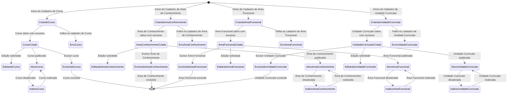

## Diagrama de Sequecia

```mermaid
stateDiagram-v2
    [*] --> CriandoCurso : Início do Cadastro de Curso
    CriandoCurso --> CursoCriado : Curso salvo com sucesso
    CriandoCurso --> ErroCurso : Falha no cadastro de Curso

    CursoCriado --> EditandoCurso : Edição solicitada
    CursoCriado --> AtivoCurso : Curso publicado
    AtivoCurso --> InativoCurso : Curso desativado
    InativoCurso --> AtivoCurso : Curso reativado
    CursoCriado --> ExcluindoCurso : Excluir curso
    ExcluindoCurso --> [*] : Curso excluído

    [*] --> CriandoAreaConhecimento : Início do Cadastro de Área de Conhecimento
    CriandoAreaConhecimento --> AreaConhecimentoCriada : Área de Conhecimento salva com sucesso
    CriandoAreaConhecimento --> ErroAreaConhecimento : Falha no cadastro de Área de Conhecimento

    AreaConhecimentoCriada --> EditandoAreaConhecimento : Edição solicitada
    AreaConhecimentoCriada --> AtivoAreaConhecimento : Área de Conhecimento publicada
    AtivoAreaConhecimento --> InativoAreaConhecimento : Área de Conhecimento desativada
    InativoAreaConhecimento --> AtivoAreaConhecimento : Área de Conhecimento reativada
    AreaConhecimentoCriada --> ExcluindoAreaConhecimento : Excluir Área de Conhecimento
    ExcluindoAreaConhecimento --> [*] : Área de Conhecimento excluída

    [*] --> CriandoAreaFuncional : Início do Cadastro de Área Funcional
    CriandoAreaFuncional --> AreaFuncionalCriada : Área Funcional salva com sucesso
    CriandoAreaFuncional --> ErroAreaFuncional : Falha no cadastro de Área Funcional

    AreaFuncionalCriada --> EditandoAreaFuncional : Edição solicitada
    AreaFuncionalCriada --> AtivoAreaFuncional : Área Funcional publicada
    AtivoAreaFuncional --> InativoAreaFuncional : Área Funcional desativada
    InativoAreaFuncional --> AtivoAreaFuncional : Área Funcional reativada
    AreaFuncionalCriada --> ExcluindoAreaFuncional : Excluir Área Funcional
    ExcluindoAreaFuncional --> [*] : Área Funcional excluída

    [*] --> CriandoUnidadeCurricular : Início do Cadastro de Unidade Curricular
    CriandoUnidadeCurricular --> UnidadeCurricularCriada : Unidade Curricular salva com sucesso
    CriandoUnidadeCurricular --> ErroUnidadeCurricular : Falha no cadastro de Unidade Curricular

    UnidadeCurricularCriada --> EditandoUnidadeCurricular : Edição solicitada
    UnidadeCurricularCriada --> AtivoUnidadeCurricular : Unidade Curricular publicada
    AtivoUnidadeCurricular --> InativoUnidadeCurricular : Unidade Curricular desativada
    InativoUnidadeCurricular --> AtivoUnidadeCurricular : Unidade Curricular reativada
    UnidadeCurricularCriada --> ExcluindoUnidadeCurricular : Excluir Unidade Curricular
    ExcluindoUnidadeCurricular --> [*] : Unidade Curricular excluída

```
[Voltar](readme.md)