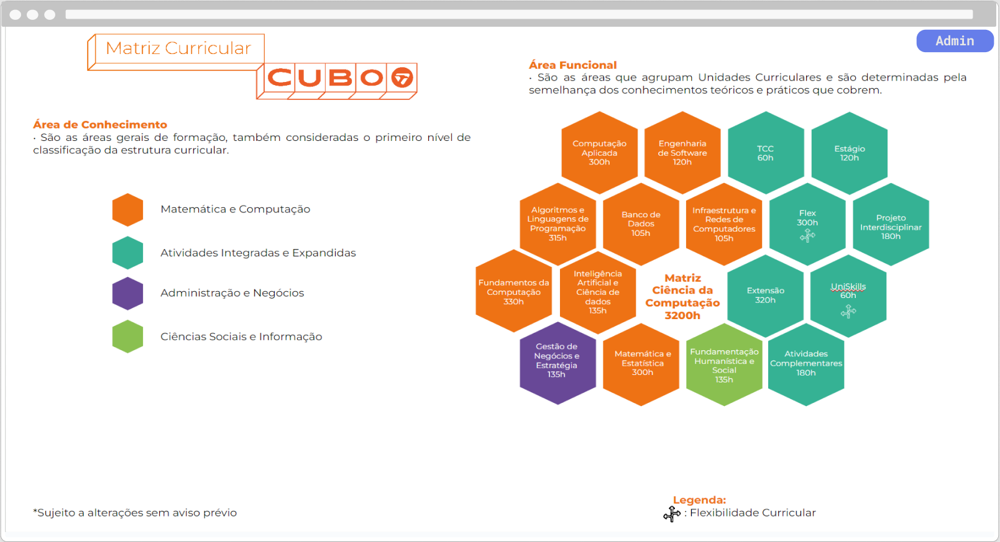
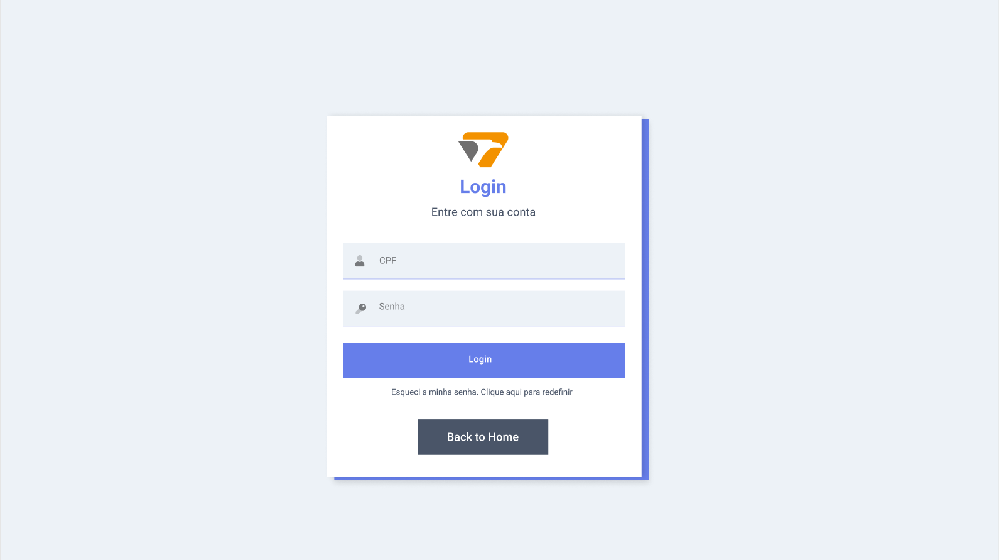
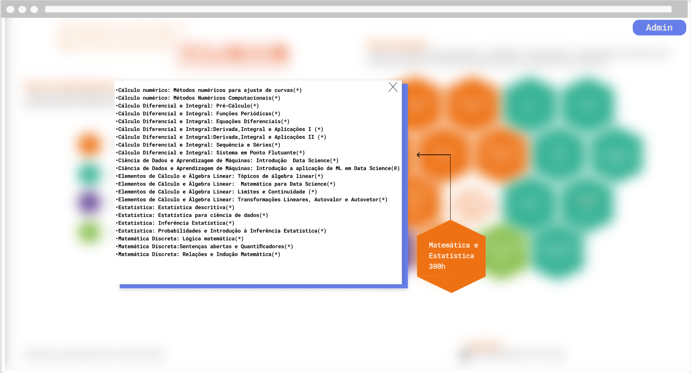
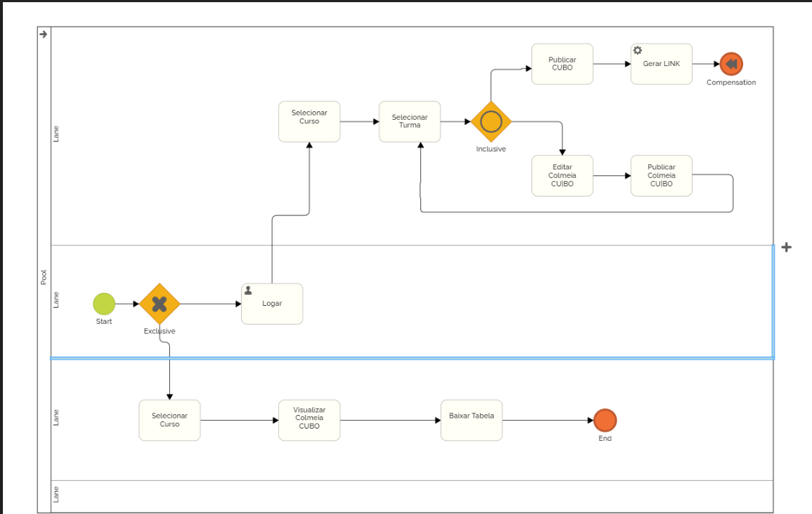

# CURSO DE BACHARELADO EM CIÊNCIA DA COMPUTAÇÃO   JOÃO VITOR DELIBERADOR   PROJETO DA COLMIA CUBO   Londrina   2024

## SUMÁRIO

- [CURSO DE BACHARELADO EM CIÊNCIA DA COMPUTAÇÃO  JOÃO VITOR DELIBERADOR  PROJETO DA COLMIA CUBO  Londrina  2024](#curso-de-bacharelado-em-ciência-da-computação--joão-vitor-deliberador--projeto-da-colmia-cubo--londrina--2024)
  - [SUMÁRIO](#sumário)
  - [INTRODUÇÃO](#introdução)
    - [PROPOSTA E OBJETIVOS](#proposta-e-objetivos)
      - [Objetivo Geral](#objetivo-geral)
      - 
    - [JUSTIFICATIVA](#justificativa)
  - [DIAGRAMA DE CASO DE USO](#diagrama-de-caso-de-uso)
  - [TELAS](#telas)
  - [WORKFLOW (AS IS) NA NOTAÇÃO BPMN](#workflow-as-is-na-notação-bpmn)
  - [RECURSOS E AMBIENTE DE DESENOVOLVIMENTO](#recursos-e-ambiente-de-desenovolvimento)
    - [LINGUAGEM DE PROGRAMAÇÃO](#linguagem-de-programação)
    - [BANCO DE DADOS](#banco-de-dados)
    - [Ferramentas de Desenvolvimento](#ferramentas-de-desenvolvimento)
    - [FRONT-END](#front-end)
    - [BACK-END](#back-end)
  - [CRONOGRAMA](#cronograma)
  - [REFERÊNCIAS](#referências)

## INTRODUÇÃO

O ambiente acadêmico contemporâneo enfrenta desafios significativos em termos de gestão e disseminação de informações curriculares. No Centro Universitário Filadélfia - UniFil, essa questão se manifesta na prática laboriosa e ineficiente de criação manual das estruturas curriculares — as "colmeias" — utilizando ferramentas de apresentação como o PowerPoint. Este método não apenas exige um investimento considerável de tempo e esforço por parte dos orientadores, mas também apresenta obstáculos significativos para a atualização e compartilhamento eficiente dessas informações vitais. A comunicação desses elementos curriculares fundamentais para o corpo estudantil, que é feita de forma manual e fragmentada, resulta em um processo propenso a atrasos e inconsistências.

Nesse cenário, a necessidade de inovação é clara e urgente. O projeto Colmeia CUBO surge como uma resposta direta a essa necessidade, propondo a digitalização e centralização das informações curriculares através de um sistema unificado. Este sistema almeja eliminar os desafios associados à criação manual e distribuição das colmeias, oferecendo uma plataforma simplificada e ágil que pode ser facilmente acessada por professores e alunos. Ao substituir as apresentações estáticas por uma ferramenta dinâmica e interativa, a Colmeia CUBO visa proporcionar economia de tempo para os orientadores e acesso instantâneo e atualizado para os alunos.

A inovação proposta pelo projeto Colmeia CUBO reflete um movimento em direção a práticas mais eficientes e sustentáveis no ensino superior. Ao aproveitar as tecnologias digitais, o sistema não apenas facilitará o gerenciamento curricular, mas também potencializará a comunicação entre docentes e discentes. Espera-se que a implementação da Colmeia CUBO resulte em uma distribuição mais eficaz de informações, permitindo que os alunos planejem seus estudos com maior independência e confiança.

Este documento apresenta uma visão detalhada da concepção e do desenvolvimento do sistema Colmeia CUBO, começando pelo contexto que motivou sua criação, passando pelos objetivos a serem atingidos e chegando até as especificações técnicas e o cronograma de execução. Através deste plano, busca-se oferecer uma compreensão clara do escopo do projeto e da transformação positiva que ele está destinado a impulsionar na UniFil, otimizando processos, melhorando a experiência educacional e alinhando a instituição com as tendências atuais de digitalização na educação.

### PROPOSTA E OBJETIVOS

#### Objetivo Geral
Desenvolver e implementar o sistema Colmeia CUBO para digitalizar e centralizar as informações curriculares dos cursos oferecidos pelo Centro Universitário Filadélfia - UniFil, proporcionando um acesso fácil e atualizado tanto para professores quanto para alunos.

####

- Substituir o método manual de criação de colmeias por uma solução digital integrada que seja fácil de atualizar e compartilhar.

- Criar uma interface intuitiva e responsiva que permita aos orientadores atualizar informações curriculares de forma eficiente.
  
- Possibilitar que os alunos acessem informações atualizadas sobre as unidades curriculares e suas respectivas cargas horárias e pré-requisitos de qualquer lugar e a qualquer momento.
  
- Reduzir a carga de trabalho dos professores, automatizando a distribuição das colmeias e permitindo mais tempo para o ensino e outras responsabilidades acadêmicas.
  
- Fomentar a autonomia dos alunos na gestão de seus percursos formativos através de uma plataforma de fácil navegação.

### JUSTIFICATIVA

A criação manual e a distribuição fragmentada de colmeias curriculares têm se mostrado um processo ineficiente e suscetível a atrasos no Centro Universitário Filadélfia - UniFil. O sistema Colmeia CUBO é uma resposta inovadora que se alinha com as diretrizes estratégicas da instituição para melhorar a comunicação acadêmica e otimizar o planejamento de estudos dos alunos. A transformação digital proposta por este sistema trará benefícios significativos, incluindo maior acessibilidade, atualizações em tempo real e uma gestão curricular mais transparente e eficaz.

## DIAGRAMA DE CASO DE USO

## TELAS

## WORKFLOW (AS IS) NA NOTAÇÃO BPMN

## RECURSOS E AMBIENTE DE DESENOVOLVIMENTO

### LINGUAGEM DE PROGRAMAÇÃO

InertiaJS com Laravel no backend e Vue.js no frontend.

### BANCO DE DADOS

 PostgreSQL, para gestão eficiente de grandes conjuntos de dados curriculares.

 ### Ferramentas de Desenvolvimento

 Ferramentas adicionais que serão utilizadas incluem Git para controle de versão, Docker para containerização e ferramentas de CI/CD para automação de testes e implantação.

### FRONT-END

### BACK-END

## CRONOGRAMA

!!!!!!!!!!!!!!! 

## REFERÊNCIAS

[Voltar](readme.md)