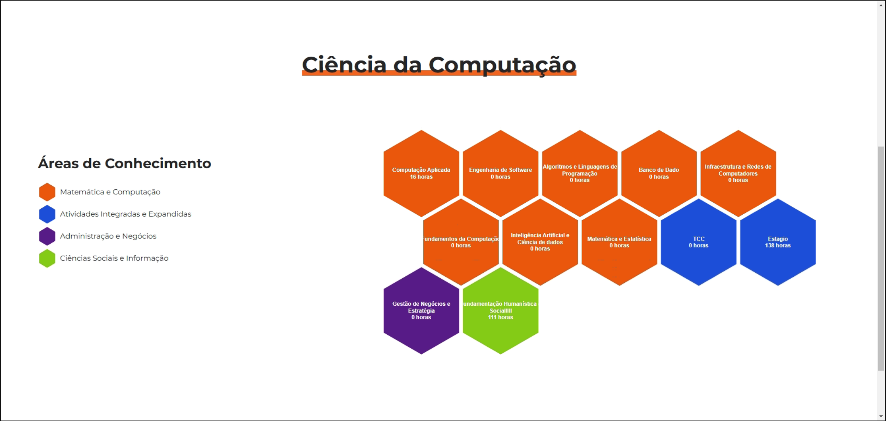
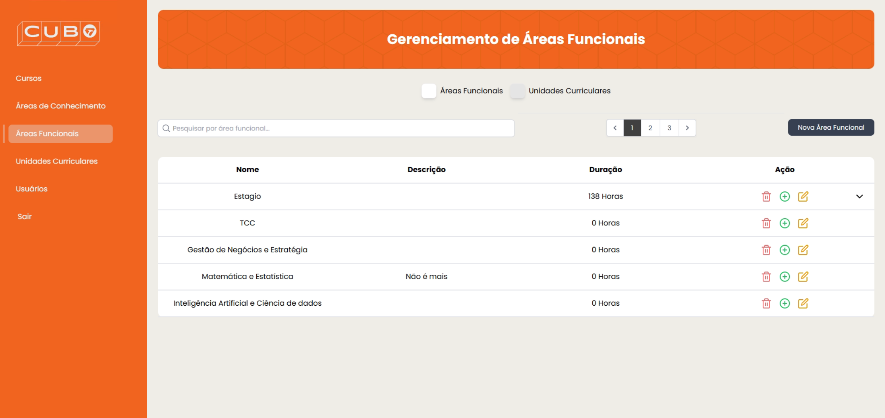

# CURSO DE BACHARELADO EM CIÊNCIA DA COMPUTAÇÃO  
JOÃO VITOR DELIBERADOR  
PROJETO DA COLMEIA CUBO  
Londrina  
2024

## SUMÁRIO

- [CURSO DE BACHARELADO EM CIÊNCIA DA COMPUTAÇÃO](#curso-de-bacharelado-em-ciência-da-computação)
  - [SUMÁRIO](#sumário)
  - [INTRODUÇÃO](#introdução)
    - [Núcleo de Práticas em Informática (NPI)](#núcleo-de-práticas-em-informática-npi)
  - [PROPOSTA E OBJETIVOS](#proposta-e-objetivos)
    - [Objetivo Geral](#objetivo-geral)
    - [Objetivos Específicos](#objetivos-específicos)
  - [JUSTIFICATIVA](#justificativa)
  - [DIAGRAMA DE CASO DE USO](#diagrama-de-caso-de-uso)
  - [TELAS](#telas)
  - [WORKFLOW (AS IS) NA NOTAÇÃO BPMN](#workflow-as-is-na-notação-bpmn)
  - [RECURSOS E AMBIENTE DE DESENVOLVIMENTO](#recursos-e-ambiente-de-desenvolvimento)
    - [LINGUAGEM DE PROGRAMAÇÃO](#linguagem-de-programação)
    - [BANCO DE DADOS](#banco-de-dados)
    - [Ferramentas de Desenvolvimento](#ferramentas-de-desenvolvimento)
    - [FRONT-END](#front-end)
    - [BACK-END](#back-end)
  - [CRONOGRAMA](#cronograma)
  - [REFERÊNCIAS](#referências)

## INTRODUÇÃO

O ambiente acadêmico contemporâneo enfrenta desafios significativos em termos de gestão e disseminação de informações curriculares. Na Universidade de Londrina (UniFil), essa questão se manifesta na prática laboriosa e ineficiente de criação manual das estruturas curriculares — as "colmeias" — utilizando ferramentas de apresentação como o PowerPoint. Este método exige investimento de tempo e esforço, dificultando a atualização e o compartilhamento eficiente dessas informações.

Para solucionar esses problemas, o projeto **Colmeia CUBO** foi desenvolvido no **Núcleo de Práticas em Informática (NPI)** do Centro Universitário Filadélfia - UniFil. Ele centraliza as informações curriculares de maneira digital, eliminando desafios associados à criação e distribuição manuais das colmeias. Este sistema é acessível para professores, alunos e, especialmente, para coordenadores, que agora possuem uma interface dedicada e funcionalidades otimizadas para gerenciamento de cursos.

### Núcleo de Práticas em Informática (NPI)

O NPI é responsável pela inovação e prática em projetos de tecnologia da informação na UniFil. Ele oferece suporte e orientação para o desenvolvimento do projeto **Colmeia CUBO**, que facilita a comunicação entre docentes e discentes e aprimora a gestão curricular.

## PROPOSTA E OBJETIVOS

### Objetivo Geral
Desenvolver e implementar o sistema **Colmeia CUBO** para digitalizar e centralizar as informações curriculares dos cursos, facilitando o acesso e a atualização para professores, alunos e coordenadores.

### Objetivos Específicos

- Substituir o método manual de criação de colmeias por uma solução digital que seja fácil de atualizar e compartilhar.
- Proporcionar uma interface dedicada para o Coordenador, permitindo o gerenciamento das áreas funcionais na ordem **Cursos > Áreas de Conhecimento > Áreas Funcionais > Unidades Curriculares (UCs)**.
- Permitir que os usuários, ao criarem UCs, incluam nome, descrição e carga horária, enquanto as Áreas de Conhecimento permitem a seleção de uma cor para personalização.
- Automatizar a distribuição das colmeias, reduzindo o tempo gasto pelos orientadores e promovendo uma melhor organização dos dados curriculares.
- Potencializar a autonomia dos alunos, que podem consultar e planejar seus estudos de forma independente.

## JUSTIFICATIVA

A criação manual e a distribuição fragmentada de colmeias curriculares são processos ineficientes e suscetíveis a atrasos. O sistema **Colmeia CUBO** digitaliza esse processo, alinhando-se com as estratégias institucionais para melhorar a comunicação e facilitar o planejamento dos alunos. A implementação deste sistema resultará em maior acessibilidade e uma gestão curricular mais eficaz.

## DIAGRAMA DE CASO DE USO

Abaixo está o diagrama de caso de uso do projeto, onde são detalhadas as principais funcionalidades:

- **Gerenciar Cursos**: O Coordenador pode adicionar, atualizar, remover ou visualizar informações sobre os cursos.
- **Gerenciar Áreas de Conhecimento**: Facilitado pela nova interface para definir, atualizar ou consultar áreas específicas, agora com opção de seleção de cor.
- **Gerenciar Unidades Curriculares (UCs)**: Permite a adição de nome, descrição e carga horária.
- **Acessar Colmeia**: Interface de visualização para alunos e professores.

## TELAS

- **Tela Inicial (Home)**: Exibe a visualização em "Colmeia", mostrando todas as áreas e unidades curriculares de forma visual, acessível para todos os usuários.
  
  

- **Tela da Colmeia**: Fornece uma visualização interativa da estrutura curricular completa.
  
  

- **Tela de Login Administrativo**: Interface de autenticação para o usuário administrativo (Coordenador).
  
  

- **Tela de Cursos**: Permite que os coordenadores gerenciem os cursos existentes.
  
  

- **Tela de Áreas de Conhecimento**: Permite que os coordenadores gerenciem as áreas de conhecimento.
  
  

- **Tela de Áreas Funcionais**: Organiza e gerencia áreas que agrupam unidades curriculares relacionadas.
  
  

- **Tela de Unidades Curriculares (UCs)**: Mostra e permite o gerenciamento das unidades curriculares.
  
  

- **Tela de Usuários**: Para administração e gerenciamento dos perfis de usuários do sistema.
  
  

## WORKFLOW (AS IS) NA NOTAÇÃO BPMN

O workflow BPMN "as is" representa o processo atual do sistema **Colmeia CUBO** antes das melhorias. O processo se inicia com o login, seguido pela seleção de curso e turma, com opções para visualizar, editar ou publicar a colmeia.

## RECURSOS E AMBIENTE DE DESENVOLVIMENTO

### LINGUAGEM DE PROGRAMAÇÃO

- **PHP (Laravel)**: Utilizado no backend para gerenciamento de banco de dados, autenticação e processamento de lógica de negócios.
- **JavaScript (Alpine.js)**: Responsável por adicionar reatividade leve no frontend.
- **Livewire**: Utilizado para componentização no Laravel, facilitando a criação de interfaces reativas e simplificadas.

### BANCO DE DADOS

- **MySQL**: Utilizado para armazenar e gerenciar os dados curriculares e informações dos usuários.

### Ferramentas de Desenvolvimento

- **Git**: Controle de versão.

### FRONT-END

- **HTML**: Estrutura do conteúdo.
- **CSS (Tailwind CSS)**: Estilização e responsividade.
- **Alpine.js**: Reatividade leve e interatividade no frontend.

### BACK-END

- **Laravel**: Framework para lógica do servidor, incluindo gerenciamento de dados e autenticação.
- **Laravel Sanctum**: Autenticação para SPA.
- **Livewire**: Utilizado para componentizar a aplicação, facilitando a construção de interfaces dinâmicas.

## CRONOGRAMA

## REFERÊNCIAS

- [Colmeia CUBO](https://unifil.br/cubo/)
- [Yggdrasil2](https://akafts.github.io/yggdrasil2/)
- [Honeycomb - Hexagons](https://abbekeultjes.nl/honeycomb/)
- [Laravel Documentation](https://laravel.com/docs/11.x)
- [Livewire Documentation](https://laravel-livewire.com/)
- [Tailwind CSS Documentation](https://tailwindcss.com/)

[Voltar](readme.md)
