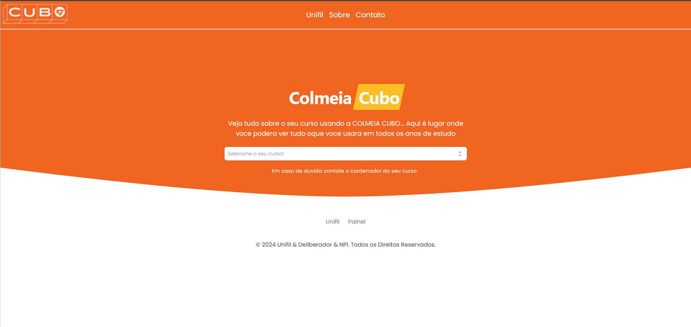
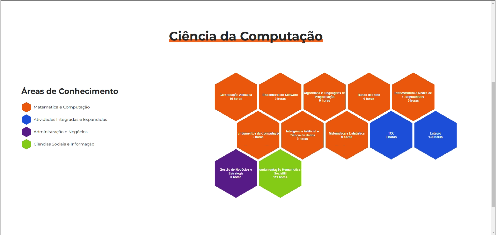
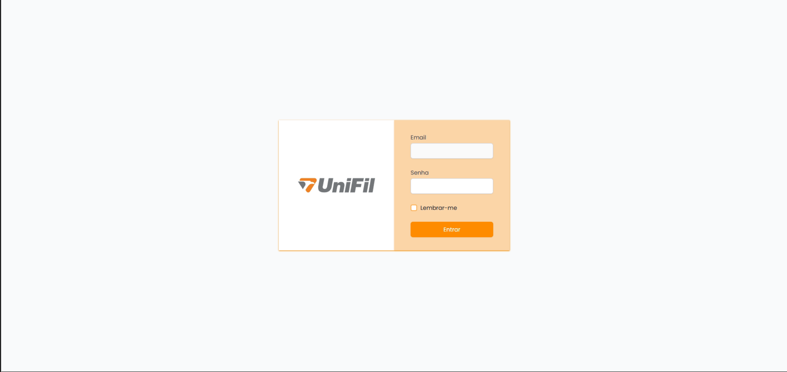
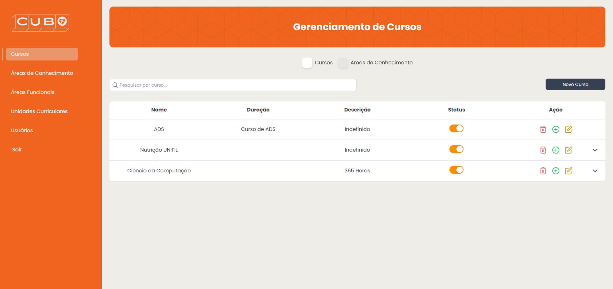
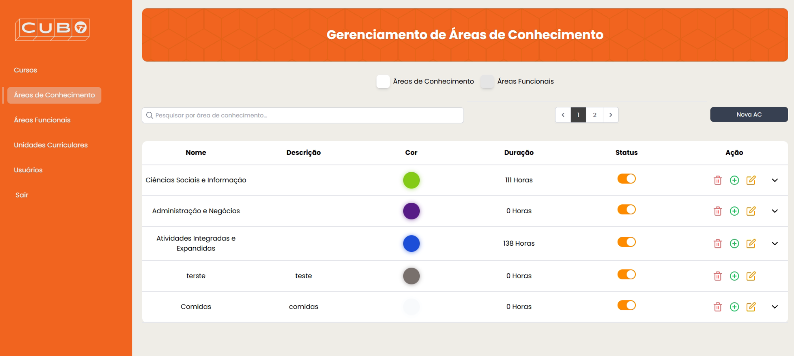
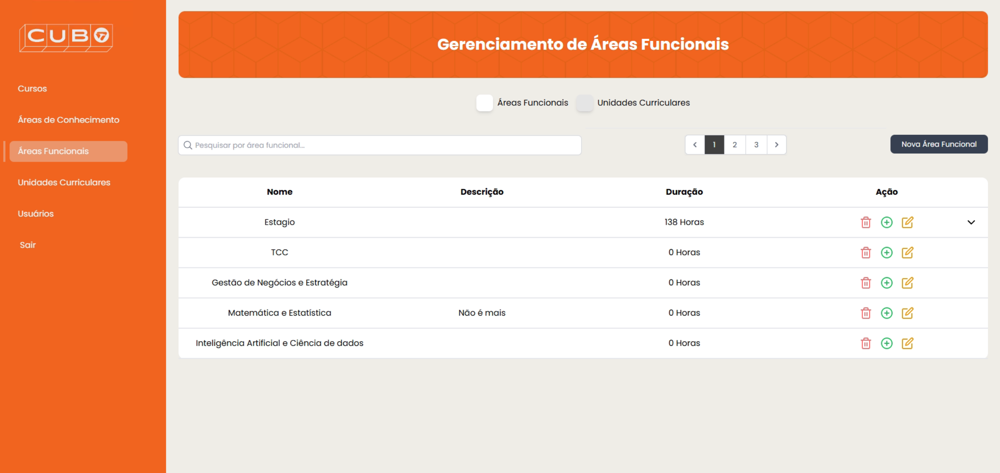
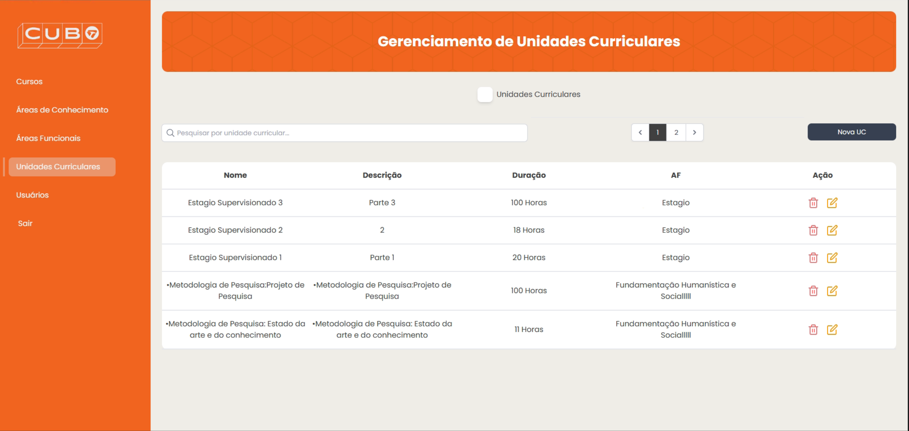
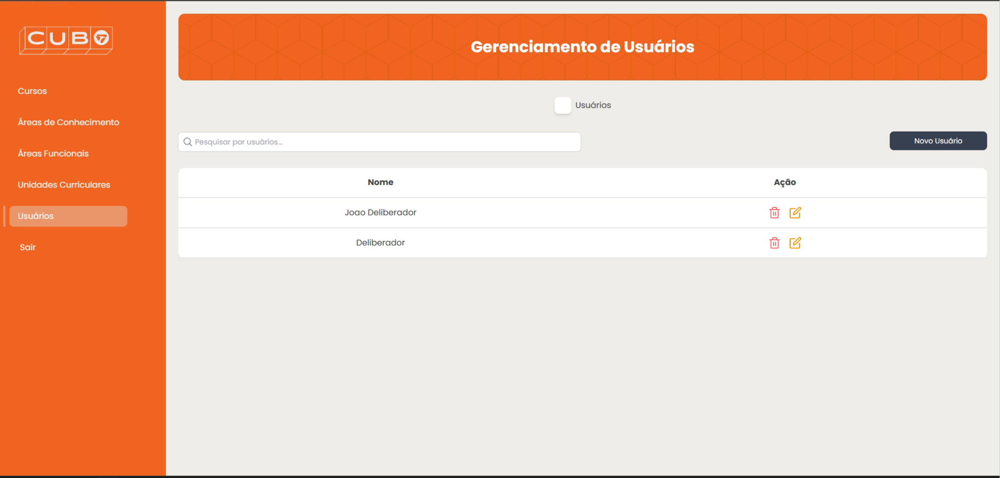

# Telas do Projeto Colmeia CUBO

## Tela Inicial (Home)

A tela inicial do sistema oferece uma visão geral do projeto Colmeia CUBO, apresentando a "Colmeia" com suas áreas de conhecimento de forma visual e organizada. Essa tela serve como ponto de partida para alunos e orientadores explorarem a estrutura curricular.

## Tela da Colmeia

A tela da Colmeia proporciona uma visualização interativa e organizada da estrutura curricular completa. Alunos e orientadores podem explorar as unidades curriculares distribuídas nas áreas de conhecimento, facilitando o entendimento da organização dos cursos.

## Tela de Login Administrativo

A tela de login administrativo é dedicada aos usuários autorizados, como orientadores, que precisam acessar funcionalidades restritas do sistema. Aqui, eles se autenticam para poder gerenciar cursos, áreas de conhecimento e unidades curriculares.

## Tela de Cursos

Essa tela permite que os orientadores visualizem e gerenciem os cursos disponíveis. Nela, é possível adicionar, editar e remover cursos, além de acessar informações detalhadas sobre cada curso, como nome, descrição e duração.

## Tela de Áreas de Conhecimento

A tela de áreas de conhecimento exibe as diferentes áreas que compõem a estrutura curricular. Os orientadores podem visualizar e gerenciar essas áreas, adicionando novas ou editando as existentes conforme necessário.

## Tela de Áreas Funcionais

Na tela de áreas funcionais, os orientadores podem organizar as áreas que agrupam unidades curriculares relacionadas. Essa tela facilita o gerenciamento de áreas funcionais que suportam o desenvolvimento dos cursos.

## Tela de Unidades Curriculares (UCs)

Essa tela exibe as unidades curriculares e permite que os orientadores realizem operações como adicionar, editar e excluir UCs. Cada unidade curricular possui informações detalhadas, incluindo carga horária e a área de conhecimento associada.

## Tela de Usuários

A tela de usuários é onde os administradores podem gerenciar os perfis dos usuários do sistema. Nela, é possível adicionar novos usuários, editar informações e definir permissões, garantindo que cada usuário tenha acesso adequado às funcionalidades.

---

[Voltar](readme.md)
